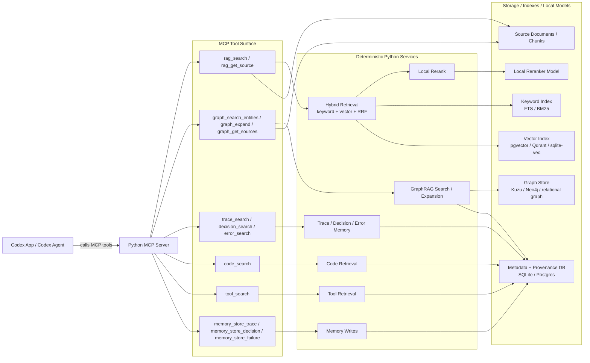

# MCP Tools

This document describes the MCP-facing runtime path for interactive use from
Codex App or another Codex surface.

For the current source of truth, see [specification.md](specification.md).

## Runtime Boundary

In the interactive path, Codex calls the Python MCP server directly. The Python
orchestrator and Codex SDK batch jobs are not in this request path.



## What Codex Does In This Path

Codex remains the agentic controller, but it is outside this server.

Codex decides:

- which MCP tool to call
- how to decompose the query
- whether to search documents, graph, traces, decisions, errors, code, or tools
- whether the returned context is sufficient
- whether to call more tools
- how to synthesize or act on the returned context

The Python MCP server executes deterministic retrieval work:

- keyword search
- vector search
- hybrid merge
- local rerank
- graph search and expansion
- source and provenance lookup
- trace, decision, error, code, and tool memory retrieval
- durable memory writes

## Tool Groups

### General RAG Tools

```text
rag_ingest_path(path, scope, tags, options)
rag_search(query, scopes, kinds, filters, top_k, rerank, graph_expand)
rag_get_source(source_id, around)
```

### GraphRAG Tools

```text
graph_search_entities(query, filters, top_k)
graph_search_claims(query, filters, top_k)
graph_expand(entity_id, depth, relation_types, filters)
graph_get_sources(graph_item_id)
```

### Memory Retrieval Tools

```text
trace_search(query, filters, top_k, rerank)
decision_search(query, filters, top_k, rerank)
error_search(query, filters, top_k, rerank)
code_search(query, filters, top_k, rerank)
tool_search(query, filters, top_k, rerank)
```

### Memory Write Tools

```text
memory_store_trace(payload)
memory_store_decision(payload)
memory_store_failure(payload)
```

## Non-interactive Jobs

Batch and management jobs are a separate path. They may use Python orchestration
and Codex SDK for entity, relation, and claim extraction, graph curation, evals,
or maintenance. Those jobs can write to the same storage layer, but they are not
the path Codex App uses when it calls MCP tools.
