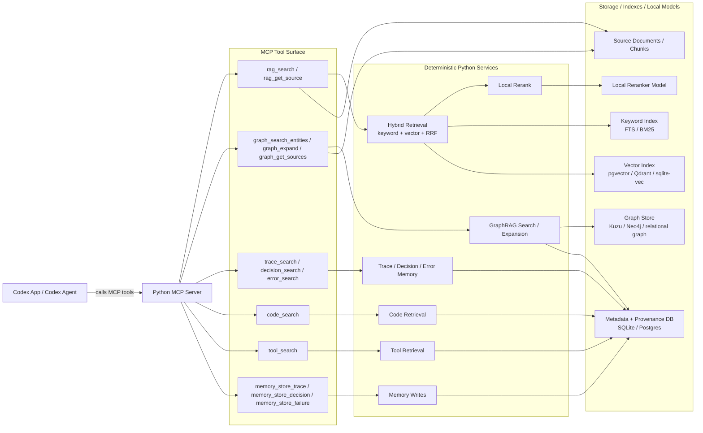

# MCP Tools

This document describes the MCP-facing runtime path for interactive use from
Codex App or another Codex surface.

For the current source of truth, see [specification.md](specification.md).

## Runtime Boundary

In the interactive path, Codex calls the Python MCP server directly. The Python
orchestrator and Codex SDK batch jobs are not in this request path.



## What Codex Does In This Path

Codex remains the agentic controller, but it is outside this server.

Codex decides:

- which MCP tool to call
- how to decompose the query
- whether to search documents, graph, traces, decisions, errors, code, or tools
- whether the returned context is sufficient
- whether to call more tools
- how to synthesize or act on the returned context

The Python MCP server executes deterministic retrieval work:

- keyword search
- vector search
- hybrid merge
- local rerank
- graph search and expansion
- source and provenance lookup
- trace, decision, error, code, and tool memory retrieval
- durable memory writes

## Tool Groups

### General RAG Tools

```text
rag_ingest_path(path, scope, tags, options)
rag_search(query, scopes, kinds, filters, top_k, rerank, graph_expand)
rag_get_source(source_id, around)
```

### GraphRAG Tools

```text
graph_search_entities(query, filters, top_k)
graph_search_claims(query, filters, top_k)
graph_expand(entity_id, depth, relation_types, filters)
graph_get_sources(graph_item_id)
```

### Memory Retrieval Tools

```text
trace_search(query, filters, top_k, rerank)
decision_search(query, filters, top_k, rerank)
error_search(query, filters, top_k, rerank)
code_search(query, filters, top_k, rerank)
tool_search(query, filters, top_k, rerank)
```

### Memory Write Tools

```text
memory_store_trace(payload)
memory_store_decision(payload)
memory_store_failure(payload)
```

## Non-interactive Jobs

Batch and management jobs are a separate path. They may use Python orchestration
and Codex SDK for entity, relation, and claim extraction, graph curation, evals,
or maintenance. Those jobs can write to the same storage layer, but they are not
the path Codex App uses when it calls MCP tools.

## Concrete Tool Contracts

Implementation: `mcp_server/tools.py` (handlers), `mcp_server/schemas.py`
(I/O models). All tools return structured output. Run the server with
`uv run multi-rag-harness serve` (stdio).

### Shared shapes

`filters` (all search tools) — optional object:

```text
repo, path_prefix, language, source_type: string
tags: [string]                # OR semantics
created_after, created_before, valid_at: ISO-8601 datetime
include_expired: bool = false # show temporally expired items
confidence_min: number        # graph claims only
```

Search results are compact and source-grounded (spec-required fields):

```text
{id, kind, score, source_id, source_path, title, excerpt, metadata}
```

`id` is a chunk id (or graph item id); `source_id` is the owning document id.
Both are accepted by `rag_get_source`. Search responses wrap results as
`{results, query, reranked}`.

### General RAG

- `rag_ingest_path(path, scope="default", tags?, options?)` → ingest report
  (`documents_ingested/skipped/updated`, `chunks_indexed`,
  `extraction_runs_created`). `options.kind` overrides detected kind;
  `options.extract` queues graph extraction runs. Unchanged files are skipped
  by content hash; changed files are re-indexed in place.
- `rag_search(query, scopes?, kinds?, filters?, top_k=10, rerank?,
  graph_expand=false)` → hybrid keyword+vector search merged with RRF (k=60),
  optionally reranked by the local cross-encoder (default from config).
  `graph_expand=true` appends up to 5 linked entities (kind="entity") to the
  result tail.
- `rag_get_source(source_id, around=1)` → full context. Chunk id: that chunk
  ± `around` neighbors; document id: the document head. Response:
  `{source_id, source_path, title, kind, chunks[{chunk_id, ordinal,
  heading_path, text, is_target}], metadata}`.

### GraphRAG

- `graph_search_entities(query, filters?, top_k=10)` → entity results
  (title = canonical name, excerpt = description).
- `graph_search_claims(query, filters?, top_k=10)` → claim results
  (metadata carries modality/confidence; `filters.confidence_min` applies).
- `graph_expand(entity_id, depth=1, relation_types?, filters?)` → BFS
  neighborhood, depth clamped 1–3, capped at 25 entities / 50 relations /
  20 claims. Response: compact `{root_entity_id, entities, relations, claims}`
  summaries.
- `graph_get_sources(graph_item_id)` → provenance rows:
  `{source_id, source_path, chunk_id, evidence_text, excerpt}`.

### Memory Retrieval

`trace_search / decision_search / error_search / code_search / tool_search
(query, filters?, top_k=10, rerank?)` are `rag_search` constrained to one kind
(`trace/decision/error/code/tool`). Superseded decisions are hidden by default
(temporal validity); pass `filters.include_expired=true` to see them.

### Memory Writes

- `memory_store_trace(payload)` — task, outcome, prompt_summary?, tools_used,
  commands, files_read, files_changed, errors, tests, final_response?,
  human_feedback?, linked_decisions, linked_entities, scope, tags, metadata.
- `memory_store_decision(payload)` — title, decision, status
  (proposed|accepted|rejected|superseded), context?, rationale?, alternatives,
  consequences?, source_links, related_entities, supersedes?, scope, tags,
  metadata. Setting `supersedes` marks the old decision superseded and expires
  its search chunks.
- `memory_store_failure(payload)` — error_text, error_category?, command?,
  environment?, suspected_cause?, confirmed_cause?, fix_applied?,
  verification?, related_traces, related_code_paths, scope, tags, metadata.

All three return `{record_id, document_id}`: the typed record id and the
searchable memory document id. Tool records (for `tool_search`) are written
via the Python API (`ToolMemoryService.store`), not an MCP tool — the spec
surface is fixed at these 15 tools.

### Extraction runs

Graph extraction is never triggered inside an MCP tool call. Ingest with
`options.extract=true` (or `codex.auto_extract_on_ingest`) queues pending
runs; `uv run multi-rag-harness extract` drains them through Codex SDK.
